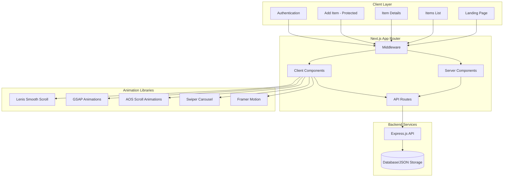
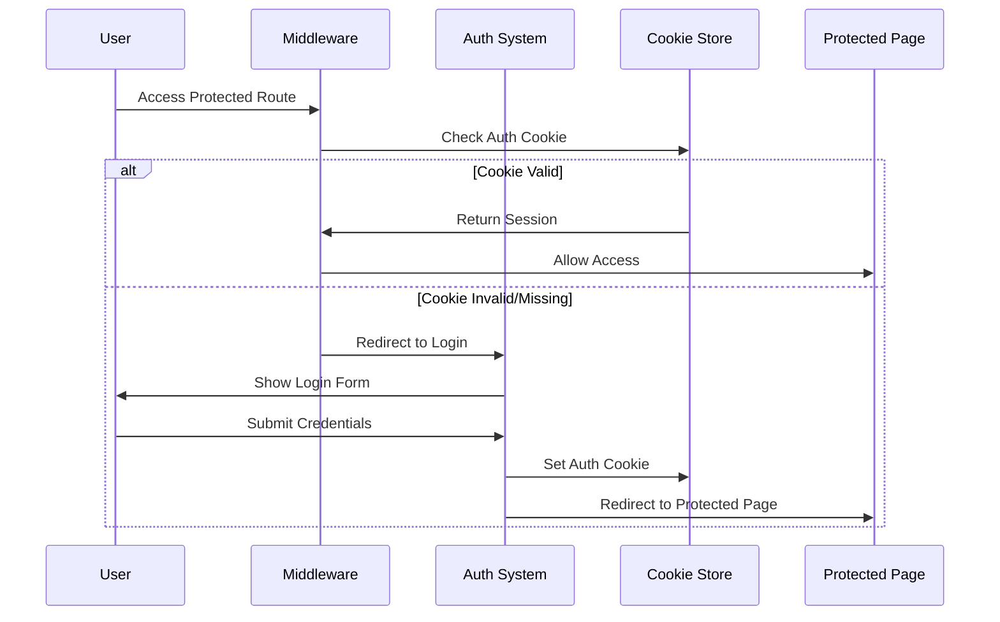

# Design Document: Next.js Item Store

## Overview

The Next.js Item Store is a modern e-commerce-style application built with Next.js 15/16 using the App Router. The application features a visually appealing landing page, authentication system, item browsing capabilities, and optional protected item creation functionality. The design emphasizes smooth animations, modern UI patterns, and seamless integration between frontend and backend systems.

The application follows a client-server architecture with Next.js handling the frontend and an Express.js server managing the API layer. Authentication is implemented using both mock credentials and optionally NextAuth.js for enhanced security and social login capabilities.

## Architecture

### System Architecture



### Authentication Flow



## Components and Interfaces

### Core Components

#### 1. Layout Components

- **RootLayout**: Main layout wrapper with navigation and footer
- **Navbar**: Navigation component with authentication-aware links
- **Footer**: Site footer with relevant links and information

#### 2. Page Components

- **LandingPage**: Hero section with 7 content sections
- **ItemsList**: Grid/list view of all items with filtering
- **ItemDetails**: Detailed view of individual items
- **AddItem**: Protected form for creating new items
- **LoginPage**: Authentication form with mock and optional social login

#### 3. UI Components

- **ItemCard**: Reusable card component for item display
- **LoadingSpinner**: Loading state indicator
- **Toast**: Notification component for user feedback
- **AnimatedSection**: Wrapper for scroll-triggered animations

#### 4. Animation Components

- **SmoothScrollProvider**: Lenis integration wrapper
- **GSAPAnimations**: GSAP animation utilities
- **HeroCarousel**: Swiper-based carousel for hero section

### Component Interfaces

```typescript
// Item Data Structure
interface Item {
  id: string;
  name: string;
  description: string;
  price: number;
  image: string;
  category?: string;
  createdAt: Date;
  updatedAt: Date;
}

// User Authentication
interface User {
  id: string;
  email: string;
  name?: string;
  image?: string;
}

// Authentication Session
interface Session {
  user: User;
  expires: string;
}

// API Response Structure
interface ApiResponse<T> {
  success: boolean;
  data?: T;
  error?: string;
  message?: string;
}
```

### API Endpoints

#### Express.js API Routes

- `GET /api/items` - Fetch all items
- `GET /api/items/:id` - Fetch single item by ID
- `POST /api/items` - Create new item (protected)
- `PUT /api/items/:id` - Update item (protected)
- `DELETE /api/items/:id` - Delete item (protected)

#### Next.js API Routes

- `POST /api/auth/login` - Handle mock authentication
- `POST /api/auth/logout` - Handle logout
- `GET /api/auth/session` - Get current session

## Data Models

### Item Model

```typescript
interface Item {
  id: string; // Unique identifier
  name: string; // Item name (required, max 100 chars)
  description: string; // Item description (required, max 500 chars)
  price: number; // Price in cents (required, positive)
  image: string; // Image URL (required, valid URL)
  category: string; // Item category (optional)
  createdAt: Date; // Creation timestamp
  updatedAt: Date; // Last update timestamp
}
```

### User Model

```typescript
interface User {
  id: string; // Unique identifier
  email: string; // Email address (required, valid email)
  name: string; // Display name (optional)
  image: string; // Profile image URL (optional)
  createdAt: Date; // Account creation timestamp
}
```

### Session Model

```typescript
interface Session {
  user: User; // User information
  expires: string; // Session expiration (ISO string)
  accessToken?: string; // Optional access token
}
```

### Form Validation Schemas

```typescript
// Item Creation Form
const ItemFormSchema = {
  name: {
    required: true,
    minLength: 1,
    maxLength: 100,
  },
  description: {
    required: true,
    minLength: 10,
    maxLength: 500,
  },
  price: {
    required: true,
    type: "number",
    min: 0.01,
  },
  image: {
    required: true,
    type: "url",
  },
};

// Login Form
const LoginFormSchema = {
  email: {
    required: true,
    type: "email",
  },
  password: {
    required: true,
    minLength: 6,
  },
};
```

Now I need to use the prework tool to analyze the acceptance criteria before writing the correctness properties:

<function_calls>
<invoke name="prework">
<parameter name="featureName">nextjs-item-store

## Correctness Properties

_A property is a characteristic or behavior that should hold true across all valid executions of a system—essentially, a formal statement about what the system should do. Properties serve as the bridge between human-readable specifications and machine-verifiable correctness guarantees._

### Property 1: Smooth scrolling integration

_For any_ page in the application, Lenis smooth scrolling should be initialized and provide smooth scroll behavior across all scroll interactions
**Validates: Requirements 1.4**

### Property 2: Authentication session management

_For any_ successful login, the authentication system should store session data in cookies and maintain that session across page refreshes until logout
**Validates: Requirements 2.2, 2.6**

### Property 3: Protected route access control

_For any_ protected route (add item page), unauthenticated users should be redirected to the login page when attempting access
**Validates: Requirements 2.3, 5.2**

### Property 4: API data fetching consistency

_For any_ API request to the Express server, the application should make properly formatted requests and handle responses consistently
**Validates: Requirements 3.2**

### Property 5: Item card information completeness

_For any_ item displayed in a card format, the card should contain all required properties (name, description, price, image) when those properties exist in the item data
**Validates: Requirements 3.3**

### Property 6: Item navigation functionality

_For any_ item card that is clicked, the application should navigate to the correct item details page using the item's ID
**Validates: Requirements 3.6**

### Property 7: Responsive design consistency

_For any_ viewport size within the supported range, all components should maintain proper layout and functionality across different screen dimensions
**Validates: Requirements 3.7, 4.7, 7.6**

### Property 8: Item details API integration

_For any_ valid item ID, the application should fetch the correct item data from the Express server and display comprehensive item information
**Validates: Requirements 4.3, 4.4**

### Property 9: Form submission and API integration

_For any_ valid item creation form submission, the application should send properly formatted data to the Express server for storage
**Validates: Requirements 5.4**

### Property 10: Client-side form validation

_For any_ form input that violates validation rules, the application should prevent submission and display appropriate validation errors
**Validates: Requirements 5.7**

### Property 11: API endpoint item retrieval

_For any_ valid item ID requested through the API, the Express server should return the correct item data in proper JSON format
**Validates: Requirements 6.2**

### Property 12: Data persistence across operations

_For any_ item created through the API, the item should persist in storage and be retrievable through subsequent API calls
**Validates: Requirements 6.4**

### Property 13: JSON response format consistency

_For any_ API response from the Express server, the response should follow the defined JSON structure with proper success/error indicators
**Validates: Requirements 6.5**

### Property 14: Server-side data validation

_For any_ item creation request with invalid data, the Express server should reject the request and return appropriate validation errors
**Validates: Requirements 6.7**

### Property 15: Styling consistency across components

_For any_ component in the application, styling should be applied consistently using the chosen CSS solution and maintain visual coherence
**Validates: Requirements 7.7**

## Error Handling

### Client-Side Error Handling

#### Network Errors

- **API Timeout**: Display user-friendly message when API requests exceed timeout limits
- **Connection Lost**: Show offline indicator and retry mechanisms
- **CORS Errors**: Provide clear feedback when cross-origin requests fail

#### Authentication Errors

- **Invalid Credentials**: Display specific error messages for login failures
- **Session Expired**: Automatically redirect to login with appropriate messaging
- **Unauthorized Access**: Graceful handling of permission-denied scenarios

#### Form Validation Errors

- **Real-time Validation**: Immediate feedback for invalid inputs
- **Submission Errors**: Clear indication of which fields need correction
- **File Upload Errors**: Specific messaging for image upload failures

#### UI/UX Error States

- **Loading States**: Skeleton screens and loading indicators during data fetching
- **Empty States**: Meaningful messages when no data is available
- **404 Errors**: Custom 404 pages with navigation options

### Server-Side Error Handling

#### API Error Responses

```typescript
interface ErrorResponse {
  success: false;
  error: string;
  message: string;
  statusCode: number;
  timestamp: string;
}
```

#### Express.js Error Middleware

- **Validation Errors**: Structured responses for invalid input data
- **Database Errors**: Graceful handling of storage operation failures
- **Authentication Errors**: Proper HTTP status codes for auth failures
- **Rate Limiting**: Protection against excessive requests

#### Error Logging

- **Request Logging**: Track all API requests with timestamps and user context
- **Error Tracking**: Comprehensive logging of server errors with stack traces
- **Performance Monitoring**: Track response times and identify bottlenecks

## Testing Strategy

### Dual Testing Approach

The application will implement both unit testing and property-based testing to ensure comprehensive coverage:

**Unit Tests**: Verify specific examples, edge cases, and error conditions

- Focus on concrete scenarios and integration points
- Test specific user interactions and component behaviors
- Validate error handling and edge cases

**Property Tests**: Verify universal properties across all inputs

- Test correctness properties with randomized inputs
- Ensure system behavior holds across wide input ranges
- Validate business logic consistency

### Testing Framework Configuration

**Frontend Testing**:

- **Framework**: Jest + React Testing Library
- **Property Testing**: fast-check for JavaScript property-based testing
- **E2E Testing**: Playwright for end-to-end scenarios
- **Component Testing**: Storybook for isolated component testing

**Backend Testing**:

- **Framework**: Jest + Supertest for API testing
- **Property Testing**: fast-check for API endpoint validation
- **Database Testing**: In-memory database for isolated testing

### Property-Based Testing Configuration

Each property test will be configured with:

- **Minimum 100 iterations** per property test to ensure comprehensive coverage
- **Custom generators** for domain-specific data (items, users, forms)
- **Shrinking strategies** to find minimal failing examples
- **Test tagging** with format: **Feature: nextjs-item-store, Property {number}: {property_text}**

### Test Coverage Requirements

**Frontend Coverage**:

- Component rendering and user interactions
- Authentication flows and session management
- Form validation and submission
- API integration and error handling
- Animation library integration
- Responsive design behavior

**Backend Coverage**:

- API endpoint functionality
- Data validation and sanitization
- CORS configuration
- Error handling and logging
- Data persistence operations

### Integration Testing

**API Integration**:

- Test complete request/response cycles
- Validate data transformation between frontend and backend
- Test authentication middleware functionality
- Verify CORS configuration effectiveness

**Animation Integration**:

- Test library initialization (Lenis, GSAP, AOS, Swiper)
- Verify animation triggers and completion
- Test performance impact of animations
- Validate responsive animation behavior

**Authentication Integration**:

- Test complete login/logout flows
- Verify session persistence across page refreshes
- Test protected route access control
- Validate cookie management and security
